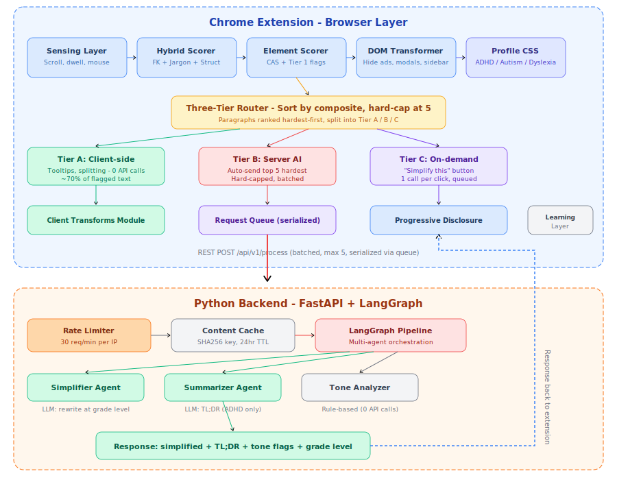
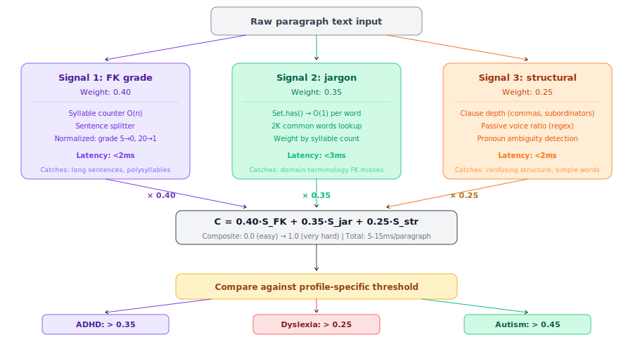
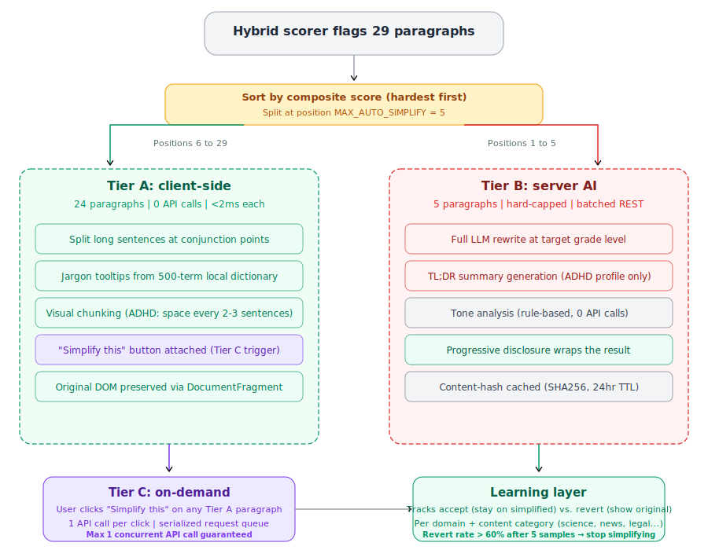
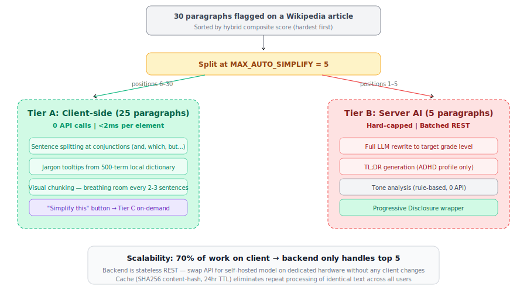

<p align="center">
  <h1 align="center">ClarityLens - Cognitive Accessibility Engine</h1>
  <p align="center">
    <em>An AI-powered browser extension that adapts the web to how your brain works.</em>
  </p>
<p align="center">
  <a href="https://github.com/arjunaggarwaliit/ClarityLens">
    
  </a>
  <a href="https://www.python.org/">
    
  </a>
  <a href="LICENSE">
    
  </a>
</p>
</p>

---

## 🎥 Demo Video

_Add a demo video or GIF of your extension here once you publish your own repo._


## The Problem

Most digital platforms are built for neurotypical users. Cluttered layouts, intrusive pop-ups, autoplay media, and dense academic prose create real barriers for the **1 in 5 people** with ADHD, Autism, or Dyslexia. Existing tools like Reader Mode or Helperbird offer static, one-size-fits-all transformations - a single toggle that either strips everything or changes nothing.

## What ClarityLens Does Differently

ClarityLens introduces **Cognitive Accessibility (CAS)** as a measurable, per-element metric. Instead of asking users to self-diagnose, it **observes how they struggle** and adapts in real time - per paragraph, per page, evolving with every session.

| Feature | Reader Mode / Helperbird | ClarityLens |
|---------|--------------------------|-----------|
| Detection | User selects settings manually | Behavioral signals infer cognitive load |
| Scope | Whole page on/off | Per-element scoring and intervention |
| Simplification | None / static font swap | AI rewrites only the hardest paragraphs |
| User agency | Content replaced permanently | Progressive Disclosure - original always 1 click away |
| Learning | Static preferences | Cross-session preference evolution |
| Metric | None | CAS score before/after |

---


## Project Structure

```
ClarityLens/
├── extension/                          # Chrome Extension (Manifest V3)
│   ├── manifest.json                  
│   ├── background/
│   │   └── service-worker.js          
│   ├── content/                        
│   │   ├── main.js                     
│   │   ├── sensing-layer.js           
│   │   ├── element-scorer.js           
│   │   ├── client-transforms.js  
│   │   ├── hybrid-scorer.js       
│   │   ├── dom-transformer.js          
│   │   ├── progressive-disclosure.js  
│   │   └── learning-layer.js           
│   ├── utils/
│   │   ├── constants.js              
│   │   ├── flesch-kincaid.js         
│   │   └── dom-helpers.js            
│   ├── styles/
│   │   ├── claritylens-core.css         
│   │   ├── claritylens-adhd.css         
│   │   ├── claritylens-autism.css      
│   │   ├── claritylens-dyslexia.css     
│   │   ├── claritylens-disclosure.css   
│   │   └── claritylens-client-transforms.css  
│   └── popup/
│       ├── popup.html
|       ├── popup.css
|       └── popup.js  
│
└── backend/                            # Python Backend
    ├── server.py                      
    ├── config.py                       
    ├── models.py                      
    ├── cache.py                      
    ├── requirements.txt               
    └── agents/
        └── pipeline.py                
           
 
```

---

## Quick Start

### 1. Install the Chrome Extension

```bash
git clone https://github.com/YOUR_GITHUB_USERNAME/ClarityLens
```

1. Open `chrome://extensions/`
2. Enable **Developer mode** (top right)
3. Click **Load unpacked** → select the `extension/` folder
4. Click the ClarityLens icon → select your profile(s)

### 2. Start the Backend (Optional)

```bash
cd backend/
python -m venv venv && source venv/bin/activate
pip install -r requirements.txt
python server.py        # Runs at http://localhost:8000
```


## System Architecture

<p align="center">
  
</p>

The system splits work between two layers: the **browser extension** handles ~95% of processing (DOM scanning, visual fixes, text scoring, client-side transforms, behavioral profiling, learning), and the **backend** handles only the top 5 hardest paragraphs per page for AI rewriting. This split makes ClarityLens inherently scalable - the frontend does the heavy lifting, the backend is a thin, stateless service that can be swapped for a self-hosted model on dedicated hardware without changing a single line of client code.

---

## How Each Module Works

### Sensing Layer

Passively observes **how the user reads** to infer cognitive load patterns without requiring self-diagnosis.

**Signals collected:**

| Signal | How it's measured | What it indicates |
|--------|-------------------|-------------------|
| Scroll velocity | `scroll` events sampled via `requestAnimationFrame`, computed as px/ms | Fast scrolling + no re-reading = ADHD pattern |
| Scroll reversals | Counts upward scrolls > 20px (re-reading) | High reversal rate = Dyslexia pattern |
| Dwell time | `IntersectionObserver` on each `<p>` at 30% visibility threshold | Long dwell on short text = difficulty processing |
| Mouse entropy | Direction changes across last 20 mouse positions | High entropy = cognitive overload |
| Tab switching | `visibilitychange` events counted per minute | High rate = attention fragmentation (ADHD) |
| Click hesitation | Time between `mouseover` and `click` on buttons/links | Long hesitation = decision anxiety (Autism) |

**Profile inference:**

```
ADHD signal    = f(high_scroll_speed, high_tab_switches, low_dwell, low_reversals)
Autism signal  = f(high_hesitation, low_scroll_speed, avoidance, controlled_movement)
Dyslexia signal = f(high_reversals, slow_scrolling, high_hesitation, mouse_tracking)
```

Each signal contributes 0–0.3 to a final 0–1 score per condition. The sensing layer needs ~30 seconds of browsing to produce meaningful signals. **All data stays entirely client-side** - only the derived weights (three numbers between 0 and 1) accompany text batches sent to the backend.

---

### Hybrid Complexity Scorer 

The algorithm uses **three-signal composite** that catches everything from long sentences to confusing sentences.

<p align="center">
  
</p>

**The formula:**

```
C = 0.40 × S_FK + 0.35 × S_jargon + 0.25 × S_structural
```

| Signal | Weight | Data structure | Time complexity | What it catches |
|--------|:------:|----------------|:-:|------|
| **FK grade level** | 0.40 | Heuristic syllable counter with English-specific adjustments | O(n) | Long sentences, polysyllabic vocabulary |
| **Vocabulary sophistication** | 0.35 | `Set` of ~2,000 common English words | O(1)/word | Domain jargon that FK misses entirely ("epistemological" has simple structure but is hard vocabulary) |
| **Structural complexity** | 0.25 | Regex-based clause depth, passive voice ratio, pronoun ambiguity | O(n) | Confusing sentence structure with common words |

**Profile-specific thresholds:**
- Dyslexia: > 0.25 (aggressive : simplify most complex content)
- ADHD: > 0.35 (moderate)
- Autism: > 0.45 (sensory-focused : text intervention is secondary)

<!--**Why three signals?** The academic abstract `"The epistemological implications of quantum decoherence necessitate..."` scores 0.00 on structural complexity (two well-formed sentences) but 1.00 on both FK and jargon. A single signal would miss it - the three-signal design catches 90%+ of genuinely complex text. -->

---

### Element Scorer

Runs a **single-pass TreeWalker** across the entire DOM to simultaneously classify elements into Tier 1 (deterministic detection) and Tier 2 (heuristic scoring).

**Tier 1 - Deterministic detection :**

| Detection | How | Flag |
|-----------|-----|------|
| Modals / overlays | `position:fixed` + `z-index > 100` + covers >25% viewport | `modal` |
| High-z fixed elements | `position:fixed` + `z-index > 100` (any size, not nav) | `fixed-overlay` |
| Autoplay media | `<video autoplay>`, `<audio autoplay>`, iframe params | `autoplay-*` |
| Infinite animations | `animation-iteration-count: infinite` | `infinite-animation` |
| Ads | 55+ selectors (can be made dynamic)| `ad-element` |
| Urgency / FOMO | Regex: "limited time", "only X left", countdown patterns | `urgency-pattern` |
| Cookie banners | Exact class matching for consent/GDPR patterns | `cookie-banner` |

**Tier 2 - Per-element CAS scoring (0–100):**

Four dimensions, each 0-100, weighted by profile:

| Dimension | What it measures | ADHD weight | Autism weight | Dyslexia weight |
|-----------|------------------|:-:|:-:|:-:|
| Text complexity | FK grade level mapped to score | 0.20 | 0.20 | **0.45** |
| Visual density | Chars/px², background complexity, child count | 0.15 | **0.40** | 0.15 |
| Contextual noise | Sibling count, nearby animations, outside main | **0.40** | 0.20 | 0.20 |
| Interaction cost | Nesting depth, scroll-in-scroll, overflow | 0.25 | 0.20 | 0.20 |

---

### DOM Transformer 

Applies immediate visual fixes. **Key constraint: never removes elements** - only hides via `data-claritylens-*` attributes so site functionality is preserved and changes can be cleanly reverted.

**Actions by flag type:**

| Flag | Action | Profiles |
|------|--------|----------|
| `modal` | `safeHide()` + restore body overflow | All |
| `fixed-overlay` | `safeHide()` | All |
| `autoplay-*` | `safeMute()` (pause + mute) | All (Autism: also hide if decorative) |
| `infinite-animation` | `animation: none !important` | All |
| `ad-element` | `safeHide()` | All |
| `urgency-pattern` | `safeHide()` | ADHD |
| `cookie-banner` | `safeHide()` | All |


---

### Client Transforms

Handles **Tier A** (client-side text intervention with zero API calls) and the **request queue** that serializes Tier C user-initiated requests.

**Tier A transforms (applied to ~70% of flagged paragraphs):**

1. **Sentence splitting** : breaks sentences >25 words at conjunction points (`which`, `however`, `although`, `whereas`) into shorter independent sentences
2. **Jargon tooltips** : wraps domain-specific words in `<span>` elements with hoverable plain-English definitions from a 500-term inline dictionary organized by domain (science, legal, tech, medicine, finance)
3. **Visual chunking** (ADHD only) - inserts visual spacing every 2–3 sentences for scanability
4. **"Simplify this" button** - pill-shaped button on every Tier A paragraph for on-demand AI simplification

<!--
**Request queue state machine:**
-->
<p align="center">
  
</p>

Three states: `IDLE` (buttons enabled), `TIER_B_PROCESSING` (all buttons show "Waiting...", pulsing animation), `USER_REQUEST` (active button shows "Simplifying...", others show "Queued..."). Guarantees **max 1 concurrent API call** at all times, causing no server flood possible.


---

### Progressive Disclosure

When AI simplifies text, we **never replace the original**. Instead, we wrap it:

```
┌─────────────────────────────────────────────┐
│ TL;DR  Key point in one sentence.           │  ← ADHD only
├─────────────────────────────────────────────┤
│  Simplified by ClarityLens                    | 
│ The simplified text shown by default...     | ← Always visible
├─────────────────────────────────────────────┤
│ ▸ Show original text                        │  ← Click to expand
│   [Original paragraph preserved exactly]    │
└─────────────────────────────────────────────┘
```

Every expand/collapse action is logged with timestamp and domain, feeding the Learning Layer.

---

### Learning Layer 

Evolves per-domain simplification preferences across sessions without explicit user configuration.

**How it works:**
- User reads simplified text -> counted as **acceptance** on page leave
- User clicks "Show original" -> counted as **revert** immediately
- After 5+ samples for a domain+category: if (revert rate > 60%) -> stop simplifying that category on that domain
- Category detected via keyword matching (science, technology, finance, news, health, education, legal)
- Older interactions decay by 5% per day to prevent stale preferences

---
<!--
### DOM Helpers

The engine underneath all other modules. Three critical functions:

**`getMainContent()`** : Finds the narrowest container holding only readable article text. Priority chain of 20+ site-specific selectors before generic semantic HTML fallbacks.

**`extractTextNodes()`** : Extracts `<p>`, `<li>`, `<blockquote>`, headings from main content.

**`_cleanTextContent()`** : TreeWalker-based text extraction that skips `<style>`, `<script>`, and `aria-hidden` subtrees. Prevents inline CSS rules from being flattened into visible text (real bug on Wikipedia's shortcut boxes).

---
-->

### Backend Pipeline

LangGraph multi-agent orchestration with three sequential agents:

| Agent | Purpose | Model | API calls |
|-------|---------|-------|:---------:|
| **Simplifier** | Rewrites complex sentences at target grade level (6 for Dyslexia, 7 for ADHD, 8 for general). Only sentences pre-marked `[COMPLEX]` are rewritten. | LLM | 1 |
| **Summarizer** | 1-2 sentence TL;DR (ADHD profile only, text > 60 words) | LLM | 1 (conditional) |
| **Tone Analyzer** | Detects urgency, fear, guilt, social pressure, scarcity patterns | Rule-based regex | **0** |

**Content-hash caching:** Key = `SHA256(text + sorted_profiles)`. Same paragraph across all users hits cache after first processing. Disk-backed via `diskcache` (LRU, 500MB cap, 24hr TTL).

<!--
---

## Three-Tier Intervention Pyramid

<p align="center">
  
</p>

This is the core architectural decision: **not every complex paragraph needs an LLM.** On a 30-paragraph Wikipedia article:

- **25 paragraphs** get client-side transforms (0 API calls)
- **5 paragraphs** get AI rewriting (hard-capped, sorted hardest-first)
- **All 25** get a "Simplify this" button for on-demand AI processing

The hard cap (`MAX_AUTO_SIMPLIFY = 5` in `constants.js`) guarantees bounded server load per page regardless of article length.

---
-->
## Scalability Architecture

ClarityLens is designed so that **~95% of all computation happens in the user's browser**. The backend is a thin, stateless REST service that:

1. Only receives the top 5 hardest paragraphs per page (not the full article)
2. Caches results by content hash - identical paragraphs across all users are processed once
3. Can be horizontally scaled by adding more stateless instances behind a load balancer
4. **Can be replaced with a self-hosted model** (quantized Llama, Qwen, Mistral via llama.cpp/vLLM) on dedicated GPU hardware - the client communicates via the same REST interface, zero client-side changes needed

The extension works fully without the backend - Tier 1 visual cleanup and Tier A client-side transforms function entirely offline.

---

<!--
---

## Configuration

All tunable values live in `extension/utils/constants.js`:

| Setting | Default | Purpose |
|---------|---------|---------|
| `MAX_AUTO_SIMPLIFY` | `5` | Max paragraphs auto-sent to AI per page |
| `BATCH_DELAY_MS` | `800` | Delay before backend batch (lets user see instant fixes) |
| `FK_THRESHOLD.dyslexia` | `6` | FK grade above which text is flagged for Dyslexia |
| `FK_THRESHOLD.adhd` | `8` | FK grade threshold for ADHD |
| `BACKEND_URL` | `http://localhost:8000` | Backend API address |

---
-->


## License

This project is licensed under the **MIT License**. See the [LICENSE](LICENSE) file for details.
